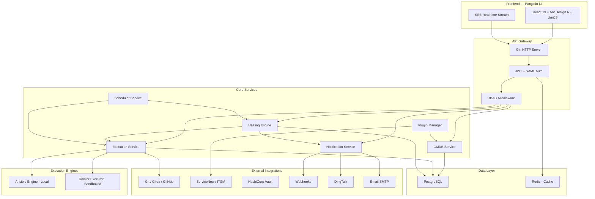
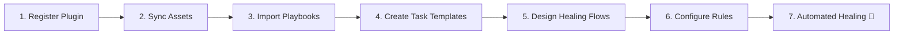

<p align="center">
  
</p>

<h1 align="center">Pangolin — Auto-Healing Platform</h1>

<p align="center">
  <strong>Intelligent infrastructure self-healing and automated remediation engine</strong>
</p>

<p align="center">
  <a href="https://github.com/heyangguang/auto-healing-ui/releases"></a>
  <a href="https://github.com/heyangguang/auto-healing-ui/blob/main/LICENSE"></a>
  <a href="https://github.com/heyangguang/auto-healing-ui/stargazers"></a>
  <a href="https://github.com/heyangguang/auto-healing-ui"></a>
  
  
  
  
</p>

<p align="center">
  <a href="./README.zh-CN.md">简体中文</a> · English
</p>

---

## 🦔 What is Pangolin?

**Pangolin** is an enterprise-grade, open-source **auto-healing platform** that automatically detects infrastructure incidents, orchestrates remediation workflows, and executes corrective actions — all without human intervention.

Think of it as a "self-driving SRE" for your infrastructure: from incident detection to automated recovery, Pangolin handles the full remediation lifecycle.

### Why Pangolin?

| Challenge | Pangolin's Answer |
|---|---|
| Manual incident response is slow | 🤖 **Automated healing flows** with visual DAG orchestration |
| Alert fatigue from monitoring tools | 🎯 **Smart rule engine** that matches and triggers only relevant flows |
| Inconsistent runbook execution | 📋 **Ansible-powered playbooks** with version-controlled templates |
| Lack of audit trail | 🔍 **Real-time forensic monitoring** via SSE with full execution logs |
| Multi-team collaboration friction | 👥 **Multi-tenant architecture** with RBAC, approval workflows, and SSO |

---

## ✨ Key Features

<table>
<tr>
<td width="50%">

### 🔄 Auto-Healing Engine
- Visual DAG-based flow designer (React Flow)
- Conditional branching, parallel execution, skip logic
- Human-in-the-loop approval gates
- Real-time instance monitoring via Server-Sent Events (SSE)

### ⚡ Execution Center
- Git repository management with branch sync
- Ansible Playbook management with variable scanning
- Reusable task templates with preset parameters
- Cron-based scheduled execution
- Full execution history with live log streaming

### 🛡️ Security & Compliance
- Command blacklist with high-risk interception
- Security exemption approval workflow
- Multi-source secrets management (Vault, Webhook, File)
- Complete audit trail for all operations

</td>
<td width="50%">

### 📊 Observability Dashboard
- Real-time healing metrics and trend analysis
- Execution success/failure rate tracking
- Resource utilization overview
- Customizable widget-based dashboard

### 🔔 Notification Center
- Multi-channel delivery (Email, DingTalk, Webhook)
- Template-based notification with variable substitution
- Delivery retry with exponential backoff
- Full notification history and forensic logs

### 🏢 Enterprise Features
- **Multi-Tenant**: Full tenant isolation with platform admin
- **RBAC**: Fine-grained role-based access control
- **SSO/SAML**: Enterprise SSO integration
- **Approval Center**: Unified decision hub for healing triggers, task approvals, access requests
- **CMDB**: Asset lifecycle management with plugin-based discovery

</td>
</tr>
</table>

---

## 🏛️ Architecture



### Backend Structure

```
auto-healing/
├── cmd/server/          # Application entry point
├── internal/
│   ├── config/          # Centralized configuration
│   ├── handler/         # HTTP handlers + DTOs
│   ├── service/         # Business logic layer
│   ├── repository/      # Data access layer (GORM)
│   ├── model/           # Domain models
│   ├── engine/          # Execution engines (Ansible/Docker)
│   ├── adapter/         # External system adapters
│   ├── scheduler/       # Background workers
│   ├── secrets/         # Credential management
│   └── pkg/             # Shared utilities (logger, response)
├── migrations/          # SQL migration files
└── docs/                # API documentation (OpenAPI)
```

### Frontend Structure

```
auto-healing-ui/
├── config/              # UmiJS + routes configuration
├── src/
│   ├── pages/           # Page components
│   │   ├── dashboard/   # Analytics dashboard
│   │   ├── healing/     # Healing flows, rules, instances
│   │   ├── execution/   # Tasks, templates, schedules, logs
│   │   ├── notification/# Channels, templates, records
│   │   ├── security/    # Command blacklist, exemptions
│   │   ├── platform/    # Multi-tenant management
│   │   └── system/      # Users, roles, permissions, audit
│   ├── components/      # Shared UI components
│   ├── services/        # API service layer
│   ├── locales/         # i18n (zh-CN)
│   └── utils/           # Utility functions
└── public/              # Static assets
```

---

## 🛠️ Tech Stack

| Layer | Technology | Version |
|---|---|---|
| **Backend** | Go | 1.22+ |
| **Web Framework** | Gin | Latest |
| **ORM** | GORM | Latest |
| **Database** | PostgreSQL | 14+ |
| **Cache** | Redis | 7+ |
| **Frontend** | React | 19 |
| **UI Library** | Ant Design | 6.x |
| **Framework** | UmiJS (Max) | 4 |
| **Workflow Editor** | React Flow | 11 |
| **Code Editor** | Monaco Editor | Latest |
| **Automation** | Ansible | 2.14+ |
| **Auth** | JWT + SAML 2.0 | — |
| **Real-time** | Server-Sent Events (SSE) | — |

---

## 📦 Multi-Platform Releases

Pangolin provides pre-built binaries for all major platforms on each release:

| OS | Architecture | Binary | Docker |
|---|---|---|---|
| **Linux** | amd64 (x86_64) | ✅ `pangolin-linux-amd64` | ✅ |
| **Linux** | arm64 (aarch64) | ✅ `pangolin-linux-arm64` | ✅ |
| **macOS** | amd64 (Intel) | ✅ `pangolin-darwin-amd64` | — |
| **macOS** | arm64 (Apple Silicon) | ✅ `pangolin-darwin-arm64` | — |
| **Windows** | amd64 (x86_64) | ✅ `pangolin-windows-amd64.exe` | — |
| **Windows** | arm64 | ✅ `pangolin-windows-arm64.exe` | — |

### Build from source

```bash
# Backend
cd auto-healing
GOOS=linux GOARCH=amd64 go build -o pangolin-linux-amd64 ./cmd/server/
GOOS=linux GOARCH=arm64 go build -o pangolin-linux-arm64 ./cmd/server/
GOOS=darwin GOARCH=amd64 go build -o pangolin-darwin-amd64 ./cmd/server/
GOOS=darwin GOARCH=arm64 go build -o pangolin-darwin-arm64 ./cmd/server/
GOOS=windows GOARCH=amd64 go build -o pangolin-windows-amd64.exe ./cmd/server/

# Frontend
cd auto-healing-ui
npm install
npm run build
# Output: dist/
```

---

## 🚀 Quick Start

### Option 1: Docker Compose (Recommended)

```bash
# Clone the repository
git clone https://github.com/heyangguang/auto-healing-ui.git
cd auto-healing-ui

# Start all services
docker compose up -d

# Access the UI
open http://localhost:8000
```

### Option 2: Manual Setup

#### Prerequisites
- Go 1.22+
- Node.js 20+
- PostgreSQL 14+
- Redis 7+
- Ansible 2.14+ (optional, for execution engine)

#### 1. Database Setup

```bash
# Start PostgreSQL
docker run -d --name pangolin-postgres \
  -e POSTGRES_USER=pangolin \
  -e POSTGRES_PASSWORD=pangolin \
  -e POSTGRES_DB=auto_healing \
  -p 5432:5432 \
  postgres:16

# Start Redis
docker run -d --name pangolin-redis \
  -p 6379:6379 \
  redis:7
```

#### 2. Backend Setup

```bash
git clone https://github.com/heyangguang/auto-healing.git
cd auto-healing

# Copy and edit configuration
cp config.example.yaml config.yaml
# Edit config.yaml with your database and Redis settings

# Run database migrations
go run cmd/migrate/main.go

# Build and start
go build -o pangolin ./cmd/server/
./pangolin
```

#### 3. Frontend Setup

```bash
git clone https://github.com/heyangguang/auto-healing-ui.git
cd auto-healing-ui

# Install dependencies
npm install

# Development mode
npm run dev

# Production build
npm run build
```

---

## 📖 Deployment Guide

### Docker Deployment

```yaml
# docker-compose.yml
version: '3.8'
services:
  postgres:
    image: postgres:16
    environment:
      POSTGRES_USER: pangolin
      POSTGRES_PASSWORD: pangolin
      POSTGRES_DB: auto_healing
    volumes:
      - pgdata:/var/lib/postgresql/data
    ports:
      - "5432:5432"

  redis:
    image: redis:7-alpine
    ports:
      - "6379:6379"

  pangolin-server:
    image: ghcr.io/heyangguang/auto-healing:latest
    ports:
      - "8080:8080"
    environment:
      - DB_HOST=postgres
      - DB_PORT=5432
      - DB_USER=pangolin
      - DB_PASSWORD=pangolin
      - DB_NAME=auto_healing
      - REDIS_HOST=redis
      - REDIS_PORT=6379
    depends_on:
      - postgres
      - redis

  pangolin-ui:
    image: ghcr.io/heyangguang/auto-healing-ui:latest
    ports:
      - "8000:80"
    depends_on:
      - pangolin-server

volumes:
  pgdata:
```

### Kubernetes Deployment

```bash
# Using Helm (coming soon)
helm repo add pangolin https://heyangguang.github.io/pangolin-charts
helm install pangolin pangolin/pangolin
```

### Bare Metal

1. Download the appropriate binary from [Releases](https://github.com/heyangguang/auto-healing-ui/releases)
2. Configure `config.yaml` with your database credentials
3. Run database migrations
4. Start the server: `./pangolin`
5. Serve the frontend `dist/` with Nginx or any static file server

<details>
<summary>📄 Example Nginx Configuration</summary>

```nginx
server {
    listen 80;
    server_name pangolin.example.com;

    # Frontend
    location / {
        root /opt/pangolin/dist;
        try_files $uri $uri/ /index.html;
    }

    # API Proxy
    location /api/ {
        proxy_pass http://127.0.0.1:8080;
        proxy_set_header Host $host;
        proxy_set_header X-Real-IP $remote_addr;
        proxy_set_header X-Forwarded-For $proxy_add_x_forwarded_for;
    }

    # SSE Proxy
    location /api/v1/sse/ {
        proxy_pass http://127.0.0.1:8080;
        proxy_set_header Connection '';
        proxy_http_version 1.1;
        chunked_transfer_encoding off;
        proxy_buffering off;
        proxy_cache off;
    }
}
```

</details>

---

## 📚 Usage Guide

### 1. First Login

After deployment, access the UI and log in with the default credentials:

| Field | Value |
|---|---|
| URL | `http://localhost:8000` |
| Username | `admin` |
| Password | `admin123456` |

> ⚠️ **Change the default password immediately after first login.**

### 2. Core Workflow



#### Step 1: Register Monitoring Plugin
Connect your ITSM/monitoring system (ServiceNow, Zabbix, etc.) as a plugin source for incident ingestion.

#### Step 2: Sync CMDB Assets
Discover and synchronize host inventory from your CMDB or cloud providers.

#### Step 3: Import Ansible Playbooks
Register your Git repositories and import Ansible playbooks with automatic variable scanning.

#### Step 4: Create Task Templates
Define reusable task templates with preset playbooks, target hosts, and variables.

#### Step 5: Design Healing Flows
Use the visual DAG editor to orchestrate multi-step healing workflows with conditions, approvals, and notifications.

#### Step 6: Configure Healing Rules
Set up rule conditions to match incoming incidents and automatically trigger healing flows.

#### Step 7: Sit Back & Watch
Pangolin automatically detects incidents, matches rules, triggers flows, executes remediation, and notifies your team.

### 3. Key Modules at a Glance

| Module | Path | Description |
|---|---|---|
| **Dashboard** | `/dashboard` | Real-time operational metrics |
| **CMDB** | `/resources/cmdb` | Host and cloud asset management |
| **Secrets** | `/resources/secrets` | SSH/API credential vault |
| **Git Repos** | `/execution/git-repos` | Source code repository management |
| **Playbooks** | `/execution/playbooks` | Ansible playbook library |
| **Templates** | `/execution/templates` | Reusable task templates |
| **Execute** | `/execution/execute` | Ad-hoc task execution |
| **Schedules** | `/execution/schedules` | Cron-based scheduled tasks |
| **Healing Flows** | `/healing/flows` | Visual flow orchestration |
| **Healing Rules** | `/healing/rules` | Incident-to-flow matching |
| **Healing Instances** | `/healing/instances` | Flow execution monitoring |
| **Approval Center** | `/pending` | Human-in-the-loop decisions |
| **Notifications** | `/notification` | Multi-channel alert management |
| **Security** | `/security` | Command blacklist & exemptions |
| **Platform Admin** | `/platform` | Multi-tenant management |
| **System** | `/system` | Users, roles, permissions |

---

## ⚙️ Configuration

### Environment Variables

| Variable | Default | Description |
|---|---|---|
| `SERVER_PORT` | `8080` | Backend server port |
| `DB_HOST` | `localhost` | PostgreSQL host |
| `DB_PORT` | `5432` | PostgreSQL port |
| `DB_USER` | `pangolin` | Database username |
| `DB_PASSWORD` | `pangolin` | Database password |
| `DB_NAME` | `auto_healing` | Database name |
| `REDIS_HOST` | `localhost` | Redis host |
| `REDIS_PORT` | `6379` | Redis port |
| `JWT_SECRET` | (auto-generated) | JWT signing secret |
| `LOG_LEVEL` | `info` | Log level (debug/info/warn/error) |
| `ANSIBLE_PATH` | `/usr/bin/ansible-playbook` | Ansible binary path |

---

## 🤝 Contributing

We welcome contributions of all kinds! See our [Contributing Guide](CONTRIBUTING.md) for details.

```bash
# Fork and clone
git clone https://github.com/<your-username>/auto-healing-ui.git

# Create a feature branch
git checkout -b feature/amazing-feature

# Make your changes, then commit
git commit -m "feat: add amazing feature"

# Push and create a Pull Request
git push origin feature/amazing-feature
```

### Development Setup

```bash
# Frontend dev server (with hot reload)
npm run dev

# Run linter
npm run lint

# Run tests
npm test

# Build production bundle
npm run build
```

---

## 📃 License

This project is licensed under the [Apache License 2.0](LICENSE).

---

## 🌟 Star History

If you find Pangolin useful, please consider giving it a ⭐!

[](https://star-history.com/#heyangguang/auto-healing-ui&Date)

---

## 💬 Community & Support

- 📖 [Documentation](https://github.com/heyangguang/auto-healing-ui/wiki)
- 🐛 [Issue Tracker](https://github.com/heyangguang/auto-healing-ui/issues)
- 💡 [Discussions](https://github.com/heyangguang/auto-healing-ui/discussions)
- 📧 Contact: [heyangguang1994@gmail.com](mailto:heyangguang1994@gmail.com)

---

<p align="center">
  Made with ❤️ by the <a href="https://github.com/heyangguang">Pangolin Team</a>
</p>
