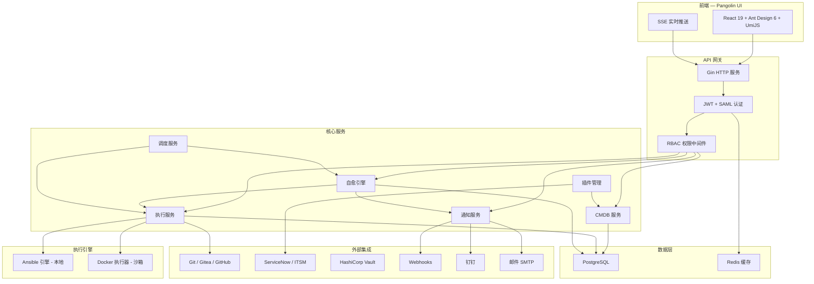
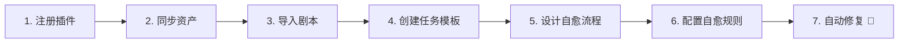

<p align="center">
  
</p>

<h1 align="center">Pangolin — 智能自愈平台</h1>

<p align="center">
  <strong>企业级基础设施自愈与自动化修复引擎</strong>
</p>

<p align="center">
  <a href="https://github.com/heyangguang/auto-healing-ui/releases"></a>
  <a href="https://github.com/heyangguang/auto-healing-ui/blob/main/LICENSE"></a>
  <a href="https://github.com/heyangguang/auto-healing-ui/stargazers"></a>
  <a href="https://github.com/heyangguang/auto-healing-ui"></a>
  
  
  
  
</p>

<p align="center">
  简体中文 · <a href="./README.md">English</a>
</p>

---

## 🦔 Pangolin 是什么？

**Pangolin**（穿山甲）是一个企业级开源**智能自愈平台**，能够自动检测基础设施故障、编排修复工作流并执行修复操作 —— 全程无需人工干预。

你可以把它理解为基础设施的"自动驾驶 SRE"：从故障发现到自动修复，Pangolin 处理完整的修复生命周期。

### 为什么选择 Pangolin？

| 挑战 | Pangolin 的解决方案 |
|---|---|
| 人工故障响应速度慢 | 🤖 **自动化自愈流程**，可视化 DAG 编排 |
| 监控工具告警疲劳 | 🎯 **智能规则引擎**，精准匹配触发 |
| 运维手册执行不一致 | 📋 **Ansible Playbook 驱动**，版本化任务模板 |
| 缺乏审计追踪 | 🔍 **实时取证监控**，SSE 推送 + 完整执行日志 |
| 多团队协作摩擦 | 👥 **多租户架构**，RBAC + 审批流 + SSO 集成 |

---

## ✨ 核心功能

<table>
<tr>
<td width="50%">

### 🔄 自愈引擎
- 可视化 DAG 流程设计器（React Flow）
- 条件分支、并行执行、跳过逻辑
- 人工审批节点（Human-in-the-Loop）
- SSE 实时实例状态推送

### ⚡ 作业中心
- Git 仓库管理与分支同步
- Ansible Playbook 管理与变量扫描
- 可复用任务模板（预设参数）
- Cron 定时调度执行
- 完整执行记录与实时日志流

### 🛡️ 安全合规
- 高危指令黑名单拦截
- 安全豁免审批工作流
- 多源密钥管理（Vault、Webhook、文件）
- 全量操作审计日志

</td>
<td width="50%">

### 📊 监控面板
- 自愈指标实时统计与趋势分析
- 执行成功/失败率追踪
- 资源使用概览
- 可定制组件化仪表盘

### 🔔 通知中心
- 多渠道投递（邮件、钉钉、Webhook）
- 模板化通知（变量替换）
- 失败重试与指数退避
- 通知历史与发送记录

### 🏢 企业级特性
- **多租户**：完整租户隔离，平台管理员统管
- **RBAC**：细粒度角色权限控制
- **SSO/SAML**：企业级单点登录集成
- **审批中心**：统一处理自愈触发、任务审批、访问请求
- **CMDB**：资产生命周期管理，插件化发现

</td>
</tr>
</table>

---

## 🏛️ 系统架构



### 后端目录结构

```
auto-healing/
├── cmd/server/          # 应用入口
├── internal/
│   ├── config/          # 集中配置
│   ├── handler/         # HTTP 处理器 + DTO
│   ├── service/         # 业务逻辑层
│   ├── repository/      # 数据访问层（GORM）
│   ├── model/           # 领域模型
│   ├── engine/          # 执行引擎（Ansible/Docker）
│   ├── adapter/         # 外部系统适配器
│   ├── scheduler/       # 后台调度器
│   ├── secrets/         # 凭证管理
│   └── pkg/             # 公共工具（日志、响应）
├── migrations/          # SQL 迁移文件
└── docs/                # API 文档（OpenAPI）
```

### 前端目录结构

```
auto-healing-ui/
├── config/              # UmiJS + 路由配置
├── src/
│   ├── pages/           # 页面组件
│   │   ├── dashboard/   # 分析仪表盘
│   │   ├── healing/     # 自愈流程、规则、实例
│   │   ├── execution/   # 任务、模板、定时、日志
│   │   ├── notification/# 渠道、模板、记录
│   │   ├── security/    # 指令黑名单、豁免
│   │   ├── platform/    # 多租户管理
│   │   └── system/      # 用户、角色、权限、审计
│   ├── components/      # 通用 UI 组件
│   ├── services/        # API 服务层
│   ├── locales/         # 国际化（zh-CN）
│   └── utils/           # 工具函数
└── public/              # 静态资源
```

---

## 🛠️ 技术栈

| 层级 | 技术 | 版本 |
|---|---|---|
| **后端语言** | Go | 1.22+ |
| **Web 框架** | Gin | Latest |
| **ORM** | GORM | Latest |
| **数据库** | PostgreSQL | 14+ |
| **缓存** | Redis | 7+ |
| **前端框架** | React | 19 |
| **UI 组件库** | Ant Design | 6.x |
| **应用框架** | UmiJS (Max) | 4 |
| **流程编辑器** | React Flow | 11 |
| **代码编辑器** | Monaco Editor | Latest |
| **自动化工具** | Ansible | 2.14+ |
| **认证** | JWT + SAML 2.0 | — |
| **实时通信** | Server-Sent Events (SSE) | — |

---

## 📦 多平台发布

Pangolin 在每个版本提供所有主流平台的预构建二进制文件：

| 操作系统 | 架构 | 二进制文件 | Docker |
|---|---|---|---|
| **Linux** | amd64 (x86_64) | ✅ `pangolin-linux-amd64` | ✅ |
| **Linux** | arm64 (aarch64) | ✅ `pangolin-linux-arm64` | ✅ |
| **macOS** | amd64 (Intel) | ✅ `pangolin-darwin-amd64` | — |
| **macOS** | arm64 (Apple Silicon) | ✅ `pangolin-darwin-arm64` | — |
| **Windows** | amd64 (x86_64) | ✅ `pangolin-windows-amd64.exe` | — |
| **Windows** | arm64 | ✅ `pangolin-windows-arm64.exe` | — |

### 从源码构建

```bash
# 后端
cd auto-healing
GOOS=linux GOARCH=amd64 go build -o pangolin-linux-amd64 ./cmd/server/
GOOS=linux GOARCH=arm64 go build -o pangolin-linux-arm64 ./cmd/server/
GOOS=darwin GOARCH=amd64 go build -o pangolin-darwin-amd64 ./cmd/server/
GOOS=darwin GOARCH=arm64 go build -o pangolin-darwin-arm64 ./cmd/server/
GOOS=windows GOARCH=amd64 go build -o pangolin-windows-amd64.exe ./cmd/server/

# 前端
cd auto-healing-ui
npm install
npm run build
# 输出目录: dist/
```

---

## 🚀 快速开始

### 方式一：Docker Compose（推荐）

```bash
# 克隆仓库
git clone https://github.com/heyangguang/auto-healing-ui.git
cd auto-healing-ui

# 启动所有服务
docker compose up -d

# 访问界面
open http://localhost:8000
```

### 方式二：手动安装

#### 前置条件
- Go 1.22+
- Node.js 20+
- PostgreSQL 14+
- Redis 7+
- Ansible 2.14+（可选，用于执行引擎）

#### 1. 数据库准备

```bash
# 启动 PostgreSQL
docker run -d --name pangolin-postgres \
  -e POSTGRES_USER=pangolin \
  -e POSTGRES_PASSWORD=pangolin \
  -e POSTGRES_DB=auto_healing \
  -p 5432:5432 \
  postgres:16

# 启动 Redis
docker run -d --name pangolin-redis \
  -p 6379:6379 \
  redis:7
```

#### 2. 后端部署

```bash
git clone https://github.com/heyangguang/auto-healing.git
cd auto-healing

# 复制并编辑配置文件
cp config.example.yaml config.yaml
# 按实际环境修改数据库和 Redis 配置

# 运行数据库迁移
go run cmd/migrate/main.go

# 构建并启动
go build -o pangolin ./cmd/server/
./pangolin
```

#### 3. 前端部署

```bash
git clone https://github.com/heyangguang/auto-healing-ui.git
cd auto-healing-ui

# 安装依赖
npm install

# 开发模式
npm run dev

# 生产构建
npm run build
```

---

## 📖 部署指南

### Docker 部署

```yaml
# docker-compose.yml
version: '3.8'
services:
  postgres:
    image: postgres:16
    environment:
      POSTGRES_USER: pangolin
      POSTGRES_PASSWORD: pangolin
      POSTGRES_DB: auto_healing
    volumes:
      - pgdata:/var/lib/postgresql/data
    ports:
      - "5432:5432"

  redis:
    image: redis:7-alpine
    ports:
      - "6379:6379"

  pangolin-server:
    image: ghcr.io/heyangguang/auto-healing:latest
    ports:
      - "8080:8080"
    environment:
      - DB_HOST=postgres
      - DB_PORT=5432
      - DB_USER=pangolin
      - DB_PASSWORD=pangolin
      - DB_NAME=auto_healing
      - REDIS_HOST=redis
      - REDIS_PORT=6379
    depends_on:
      - postgres
      - redis

  pangolin-ui:
    image: ghcr.io/heyangguang/auto-healing-ui:latest
    ports:
      - "8000:80"
    depends_on:
      - pangolin-server

volumes:
  pgdata:
```

### Kubernetes 部署

```bash
# 使用 Helm（即将推出）
helm repo add pangolin https://heyangguang.github.io/pangolin-charts
helm install pangolin pangolin/pangolin
```

### 裸机部署

1. 从 [Releases](https://github.com/heyangguang/auto-healing-ui/releases) 下载对应平台的二进制文件
2. 编辑 `config.yaml` 配置数据库连接信息
3. 运行数据库迁移
4. 启动服务：`./pangolin`
5. 使用 Nginx 或其他 Web 服务器代理前端 `dist/` 目录

<details>
<summary>📄 示例 Nginx 配置</summary>

```nginx
server {
    listen 80;
    server_name pangolin.example.com;

    # 前端静态资源
    location / {
        root /opt/pangolin/dist;
        try_files $uri $uri/ /index.html;
    }

    # API 代理
    location /api/ {
        proxy_pass http://127.0.0.1:8080;
        proxy_set_header Host $host;
        proxy_set_header X-Real-IP $remote_addr;
        proxy_set_header X-Forwarded-For $proxy_add_x_forwarded_for;
    }

    # SSE 代理（实时推送）
    location /api/v1/sse/ {
        proxy_pass http://127.0.0.1:8080;
        proxy_set_header Connection '';
        proxy_http_version 1.1;
        chunked_transfer_encoding off;
        proxy_buffering off;
        proxy_cache off;
    }
}
```

</details>

---

## 📚 使用手册

### 1. 首次登录

部署完成后，访问管理界面并使用默认凭据登录：

| 字段 | 值 |
|---|---|
| 访问地址 | `http://localhost:8000` |
| 用户名 | `admin` |
| 密码 | `admin123456` |

> ⚠️ **首次登录后请立即修改默认密码。**

### 2. 核心工作流



#### 第 1 步：注册监控插件
将你的 ITSM/监控系统（ServiceNow、Zabbix 等）注册为插件数据源，用于故障事件接入。

#### 第 2 步：同步 CMDB 资产
从 CMDB 或云服务商发现并同步主机资产清单。

#### 第 3 步：导入 Ansible Playbook
注册 Git 仓库并导入 Ansible Playbook，系统自动扫描变量。

#### 第 4 步：创建任务模板
定义可复用的任务模板，预设 Playbook、目标主机和变量参数。

#### 第 5 步：设计自愈流程
使用可视化 DAG 编辑器编排多步骤自愈工作流，支持条件判断、审批节点和通知。

#### 第 6 步：配置自愈规则
设置规则条件匹配收到的故障事件，自动触发对应的自愈流程。

#### 第 7 步：自动修复
Pangolin 自动检测故障 → 匹配规则 → 触发流程 → 执行修复 → 通知团队。

### 3. 功能模块速览

| 模块 | 路径 | 说明 |
|---|---|---|
| **监控面板** | `/dashboard` | 实时运营指标 |
| **资产管理** | `/resources/cmdb` | 主机与云资源管理 |
| **密钥管理** | `/resources/secrets` | SSH/API 凭证保险箱 |
| **代码仓库** | `/execution/git-repos` | Git 仓库管理 |
| **剧本管理** | `/execution/playbooks` | Ansible Playbook 库 |
| **任务模板** | `/execution/templates` | 可复用任务模板 |
| **任务执行** | `/execution/execute` | 即时任务执行 |
| **定时任务** | `/execution/schedules` | Cron 定时调度 |
| **自愈流程** | `/healing/flows` | 可视化流程编排 |
| **自愈规则** | `/healing/rules` | 故障-流程匹配规则 |
| **自愈实例** | `/healing/instances` | 流程执行监控 |
| **审批中心** | `/pending` | 人工决策处理 |
| **通知管理** | `/notification` | 多渠道告警管理 |
| **安全防护** | `/security` | 指令黑名单与豁免 |
| **平台管理** | `/platform` | 多租户管理 |
| **系统管理** | `/system` | 用户、角色、权限 |

---

## ⚙️ 配置参考

### 环境变量

| 变量 | 默认值 | 说明 |
|---|---|---|
| `SERVER_PORT` | `8080` | 后端服务端口 |
| `DB_HOST` | `localhost` | PostgreSQL 地址 |
| `DB_PORT` | `5432` | PostgreSQL 端口 |
| `DB_USER` | `pangolin` | 数据库用户名 |
| `DB_PASSWORD` | `pangolin` | 数据库密码 |
| `DB_NAME` | `auto_healing` | 数据库名称 |
| `REDIS_HOST` | `localhost` | Redis 地址 |
| `REDIS_PORT` | `6379` | Redis 端口 |
| `JWT_SECRET` | （自动生成） | JWT 签名密钥 |
| `LOG_LEVEL` | `info` | 日志级别（debug/info/warn/error） |
| `ANSIBLE_PATH` | `/usr/bin/ansible-playbook` | Ansible 可执行文件路径 |

---

## 🤝 参与贡献

我们欢迎各种形式的贡献！详情请参阅 [贡献指南](CONTRIBUTING.md)。

```bash
# Fork 并克隆
git clone https://github.com/<your-username>/auto-healing-ui.git

# 创建功能分支
git checkout -b feature/amazing-feature

# 提交更改
git commit -m "feat: add amazing feature"

# 推送并创建 Pull Request
git push origin feature/amazing-feature
```

### 开发环境配置

```bash
# 前端开发服务（热重载）
npm run dev

# 代码检查
npm run lint

# 运行测试
npm test

# 生产构建
npm run build
```

---

## 📃 开源协议

本项目基于 [Apache License 2.0](LICENSE) 开源。

---

## 🌟 Star 趋势

如果你觉得 Pangolin 有用，请给我们一个 ⭐！

[](https://star-history.com/#heyangguang/auto-healing-ui&Date)

---

## 💬 社区与支持

- 📖 [文档中心](https://github.com/heyangguang/auto-healing-ui/wiki)
- 🐛 [问题反馈](https://github.com/heyangguang/auto-healing-ui/issues)
- 💡 [讨论区](https://github.com/heyangguang/auto-healing-ui/discussions)
- 📧 联系我们：[heyangguang1994@gmail.com](mailto:heyangguang1994@gmail.com)

---

<p align="center">
  用 ❤️ 倾心打造 · <a href="https://github.com/heyangguang">Pangolin 团队</a>
</p>
