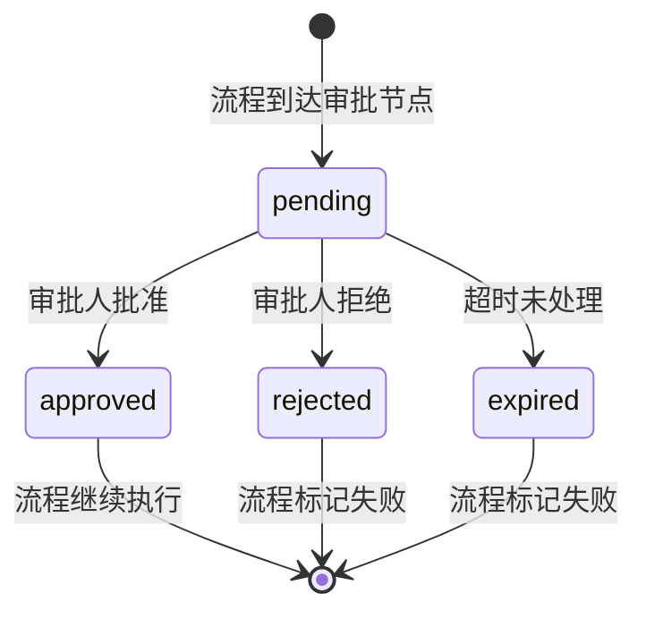

# 审批任务 API 文档

审批任务（ApprovalTask）是自愈流程中审批节点产生的人工审批请求，需要指定审批人或角色进行批准或拒绝操作。

## 数据模型

| 字段 | 类型 | 必填 | 说明 |
|------|------|------|------|
| id | string (uuid) | - | 审批任务 ID (自动生成) |
| flow_instance_id | string (uuid) | ✅ | 关联的流程实例 ID |
| node_id | string | ✅ | 审批节点 ID |
| initiated_by | string (uuid) | - | 发起人 ID |
| approvers | array | - | 指定审批人用户名列表 |
| approver_roles | array | - | 指定审批人角色列表 |
| status | string | - | 审批状态 |
| timeout_at | string | - | 超时时间 |
| decided_by | string (uuid) | - | 审批决策人 ID |
| decided_at | string | - | 审批决策时间 |
| decision_comment | string | - | 审批意见 |
| notification_sent | boolean | - | 是否已发送通知 |
| created_at | string | - | 创建时间 |
| updated_at | string | - | 更新时间 |
| flow_instance | object | - | 关联的流程实例对象 |
| initiator | object | - | 发起人用户对象 |
| decider | object | - | 决策人用户对象 |

### 审批状态 (status)

| 状态 | 说明 |
|------|------|
| `pending` | 待审批 |
| `approved` | 已批准 |
| `rejected` | 已拒绝 |
| `expired` | 已超时 |

### 审批人配置

审批任务支持两种审批人配置方式：

1. **指定用户名** (`approvers`): 只有列表中的用户可以审批
2. **指定角色** (`approver_roles`): 拥有指定角色的用户都可以审批

```json
{
  "approvers": ["admin", "ops-lead"],
  "approver_roles": ["admin", "operator"]
}
```

> [!NOTE]
> 如果同时配置了 `approvers` 和 `approver_roles`，满足任一条件的用户都可以审批。

---

## API 接口

### 1. 获取审批任务列表

**GET** `/api/v1/healing/approvals`

**Query 参数**
| 参数 | 类型 | 说明 |
|------|------|------|
| page | number | 页码 (默认 1) |
| page_size | number | 每页数量 (默认 20) |
| status | string | 筛选审批状态: `pending`, `approved`, `rejected`, `expired` |
| flow_instance_id | string (uuid) | 筛选关联的流程实例 |

**响应示例**
```json
{
  "code": 0,
  "message": "success",
  "data": [
    {
      "id": "5dd0809d-823f-4480-90a6-2bf3ed3bbdef",
      "flow_instance_id": "f96c81e4-e180-4a45-8506-855140b8d1ff",
      "node_id": "approval_1",
      "approvers": ["admin"],
      "approver_roles": ["admin"],
      "status": "expired",
      "timeout_at": "2026-01-09T16:38:14.183899+08:00",
      "decided_at": "2026-01-09T16:38:20.777359+08:00",
      "notification_sent": false,
      "created_at": "2026-01-09T15:38:14.184168+08:00",
      "updated_at": "2026-01-09T16:38:20.778049+08:00",
      "flow_instance": {
        "id": "f96c81e4-e180-4a45-8506-855140b8d1ff",
        "flow_id": "db050a65-2c93-4abf-b3f1-281b7890e446",
        "status": "failed",
        "error_message": "审批超时",
        "context": {...},
        "node_states": {...}
      }
    }
  ],
  "total": 2147,
  "page": 1,
  "page_size": 20
}
```

---

### 2. 获取待审批任务列表

**GET** `/api/v1/healing/approvals/pending`

获取所有状态为 `pending` 的审批任务，用于审批工作台快速入口。

**Query 参数**
| 参数 | 类型 | 说明 |
|------|------|------|
| page | number | 页码 (默认 1) |
| page_size | number | 每页数量 (默认 20) |

**响应示例**
```json
{
  "code": 0,
  "message": "success",
  "data": [
    {
      "id": "abc12345-...",
      "flow_instance_id": "...",
      "node_id": "approval_1",
      "approvers": ["admin"],
      "approver_roles": ["admin"],
      "status": "pending",
      "timeout_at": "2026-01-10T15:00:00+08:00",
      "created_at": "2026-01-10T14:00:00+08:00",
      "flow_instance": {...}
    }
  ],
  "total": 0,
  "page": 1,
  "page_size": 20
}
```

---

### 3. 获取审批任务详情

**GET** `/api/v1/healing/approvals/:id`

**响应**: 同列表中的单个审批任务对象

---

### 4. 批准审批任务

**POST** `/api/v1/healing/approvals/:id/approve`

**请求体**
```json
{
  "comment": "同意执行，请注意监控"
}
```

**成功响应**
```json
{
  "code": 0,
  "message": "审批已通过"
}
```

> [!NOTE]
> 批准后，流程会自动继续执行后续节点。

---

### 5. 拒绝审批任务

**POST** `/api/v1/healing/approvals/:id/reject`

**请求体**
```json
{
  "comment": "风险过高，暂不执行"
}
```

**成功响应**
```json
{
  "code": 0,
  "message": "审批已拒绝"
}
```

> [!IMPORTANT]
> 拒绝审批会导致：
> - 流程实例状态更新为 `failed`
> - 关联事件的 `healing_status` 更新为 `failed`

---

## 审批流程说明



### 超时处理

- 审批任务创建时会设置 `timeout_at` 字段
- 后台定时任务会检查超时的审批任务
- 超时后状态自动变为 `expired`，流程标记为 `failed`

---

## 权限要求

| 接口 | 权限 |
|------|------|
| GET /healing/approvals | healing:approvals:view |
| GET /healing/approvals/pending | healing:approvals:view |
| GET /healing/approvals/:id | healing:approvals:view |
| POST /healing/approvals/:id/approve | healing:approvals:approve |
| POST /healing/approvals/:id/reject | healing:approvals:approve |
